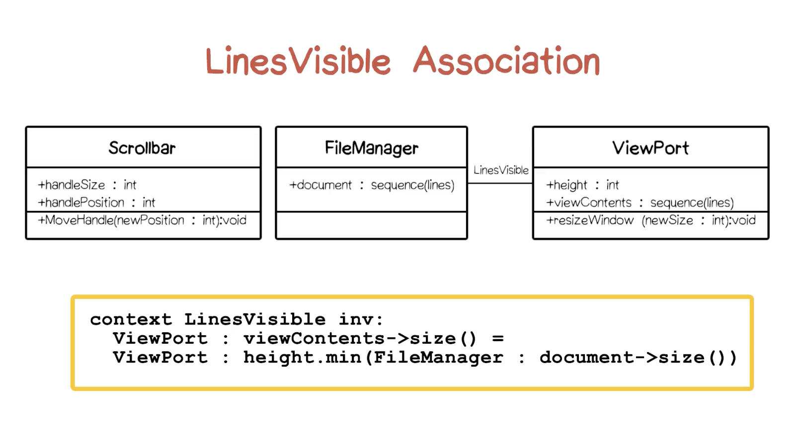
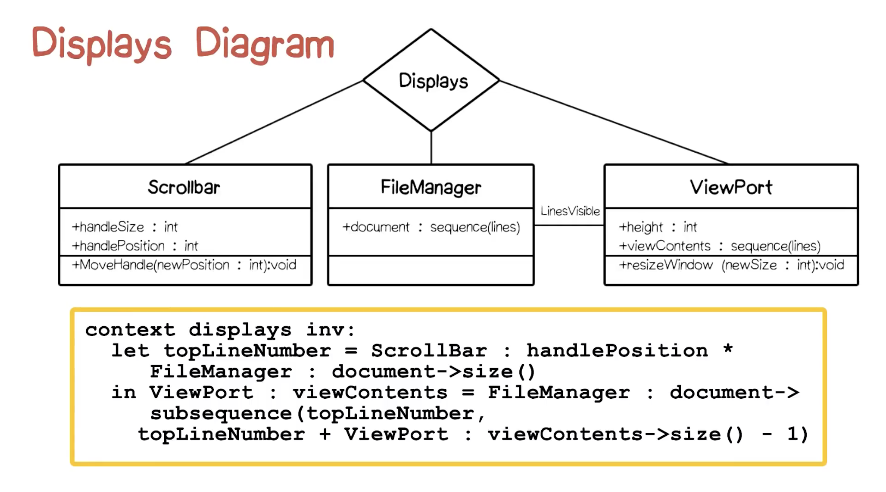
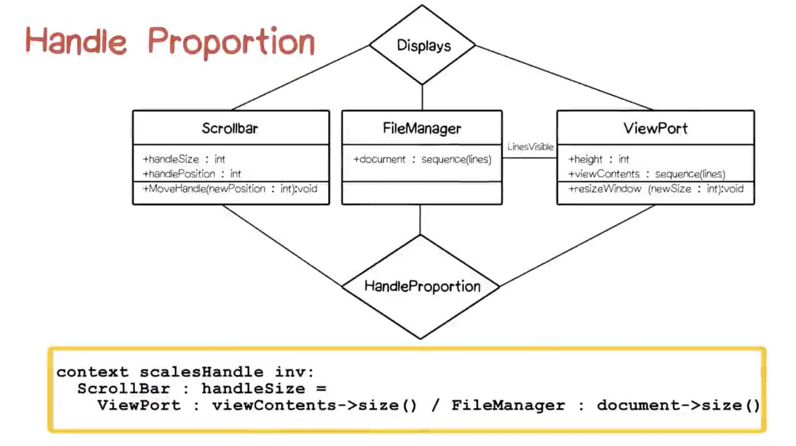

# Text Browser Exercise

## GUI components
- Window (ViewPort)
	- Need to be able to display the textual content graphically
	- Display integer number of lines
	- Resize between 1 - 100 lines
	- Text: same font, same points
- Scroll bar
	- Need to give the user some way to access different parts of the file
	- Handle, Tray
		- Porpotion of handle / tray
- File manager
	- Supplies the contents of the file
	- Not visible to the user
	- TextBrowser interacts with the file system through the operating system
	- Document is a percept that is supplied by the operating system actor

## Terminology
- Use cases: how the user will use the intended solution
- Operations: actions that the user can undertake to interact with the textbrowser
- Percepts: parts of the application which user can sees
	- E.g. viewport (height, content), scrollbar (position, size)

## Relationships
In a UML analysis model, you should be concerned with three types of relationships:
- Associations
- Aggregation
- Generalization

*Ternary association: association among three components*

## Analysis model
- UML class-model diagram
- Rectangles for classes
- Each rectangle is divided vertically
- Lines between the components denote relationshipss

