# Review of UML

## Diagrams
- Object management Techinique (OMT)
	- Developed by James Rumbaugh and others at GE
	- Comhesive view of system:
		- Structural aspect: Class model diagram
		- Behavior aspect: Statechart diagram
		- Functional aspect: Dataflow diagram
- Unified Modeling Language (UML)
	- Standardized by Object Management Group (OMG)
		- Championed by IBM - acquired a company Rational (Rational Rose)
	- Supported by CASE tools
	- Conceived by Rumbaugh, Booch, Jacobson
	- Diagrams + OCL
	- Used for analysis or design models

## UML diagram types
- Two main types:
	- Structural: describes the system as a whole 
	- Behavior: specific behavior of the system
- Value of design diagram
	- Communication (convey information)
	- Support for existing methods
	- Tool support

## Besides diagrams
- Object constraint language (OCL)
	- Textual extension to UML's visual notation
	- Applicable to class and statechart diagrams
	- First-order predicate logic + diagram navigation + collection classes
	- Enables more precise specifications
	- 
- MetaModel
	- The definition of UML in UML
	- Can be extended by a modeler using profiles
	- 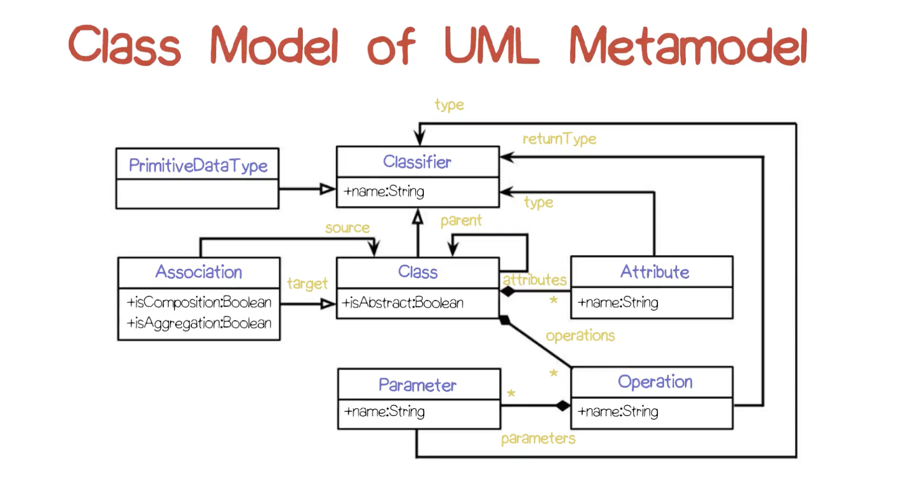

## Structural diagrams
| Type | Description |
| --- | --- |
| Class model | Components and structural properties |
| Object | Static structure at a particular time |
| Composite structure | Internal structure and possible interactions |
| Component | Organization of physical software components |
| Deployment | Physical system resources and how they map to hardware | 
| Package | Logical groupings and dependencies |
| Profile | Extensions to the UML meta model |

### Class model diagram
- Key points
	- Most popular
	- Also callsed **static models**
	- Structural properties
	- Classes and relationships
- Classes in UML
	- 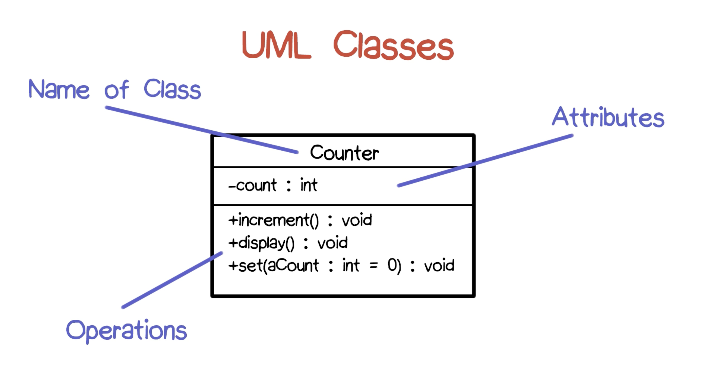
- Relationships in UML
	- 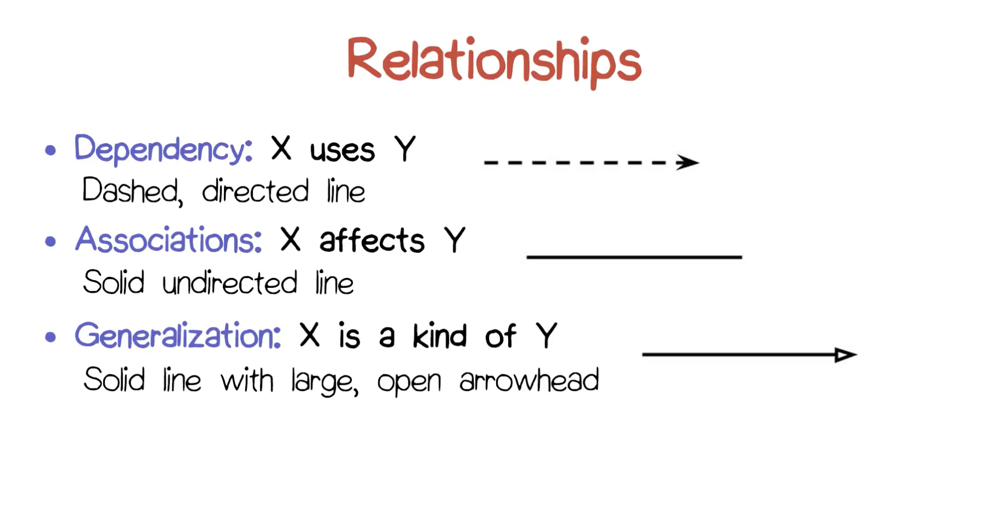

### Object diagram
- Key points
	- Similar with class model disgram
	- Instead of mentioning classes, the metion instances
	- Conveys objects and links instead of classes and relationships
	- The label compartment of the top of the boxes has two parts:
		- Name of specific instance : Class name
	- Attribute fields have attribute values filled in
- 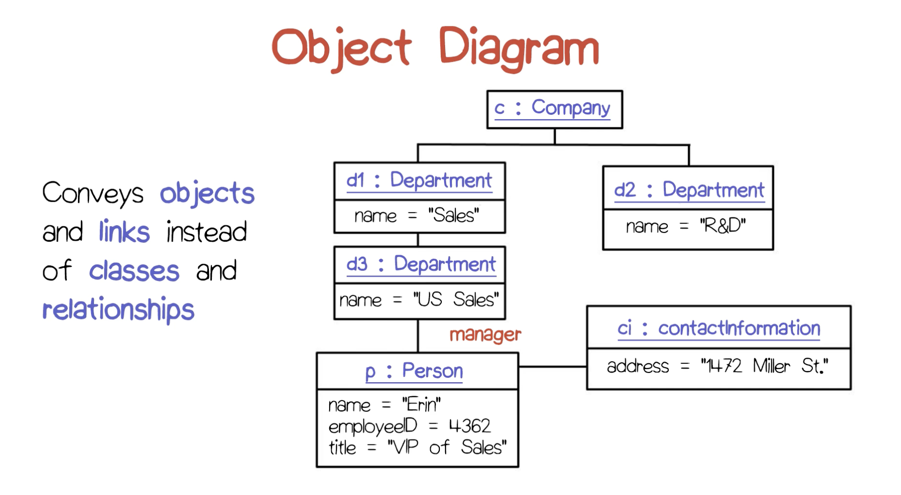

### Composite structure diagram
- Key points:
	- Conveys internal structure of a class
- 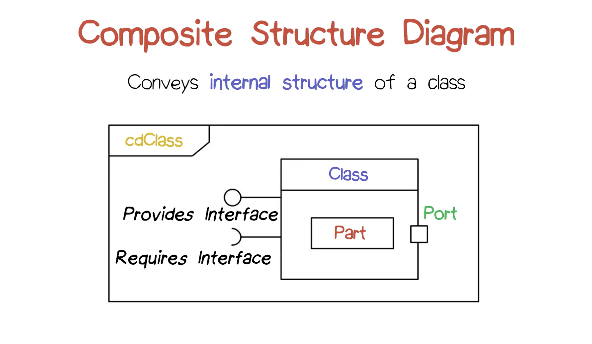

### Component diagram
- Key points:
	- Static implementation view of how the components of a system fit together
	- Component: *A physical, replaceable part of a system that packages implementation and conforms to and provides the realization of a set of interfaces*
	- Models code entities
	- Used to convey architecture
- 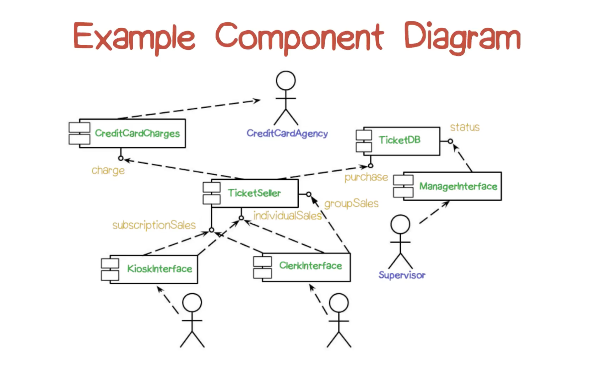

### Deployment diagram
- Key points:
	- Convey the configuration of the run-time processing units and component instances in a way, that sees how they can interact
	- Node: computational device
	- Arcs: communications
- 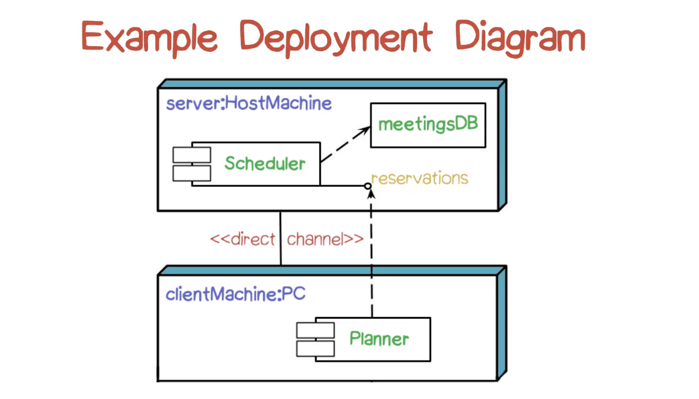

### Package diagram
- Key points:
	- General purpose organizing mechanism
	- Provides namespace scoping
	- System is the top-level package
	- Dependency arrows between packages indicate the existence of dependencies between constituents
- 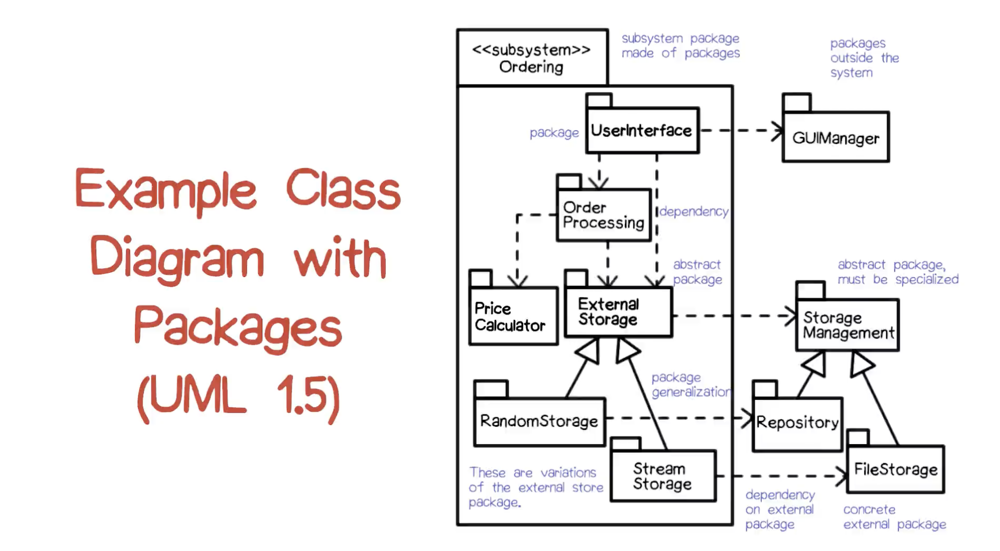

### Profile diagram
- Key points:
	- Higher level: properties of diagrams, not models
	- Profiles allow you to extend the basic UML notations
- 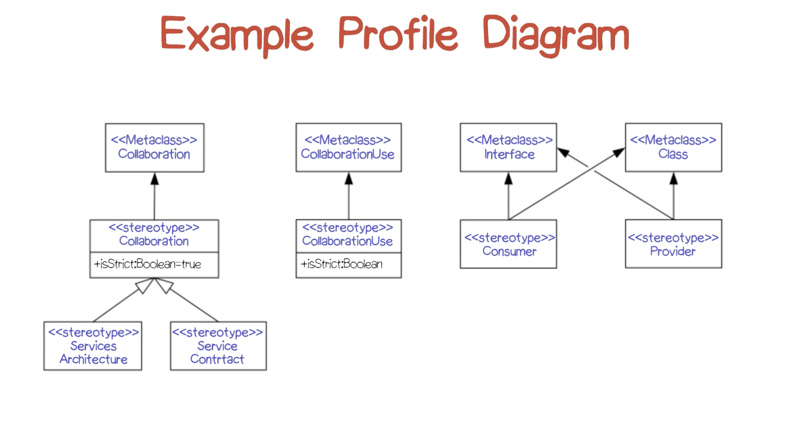

## Behavior diagrams
| Type | Description |
| --- | --- |
| Use case | System functionality provided to external actors |
| Sequence | Interaction of classes of message exchange |
| Communication | Object interaction of numbered messages |
| Activity | Flow of control from activiity to activity |
| Interaction overview | Synthesis of lower-level activity diagrams |
| Timing | Rotated sequence diagram |
| State | Dynamic behavior in response to stimuli |

### Use case diagram
- Key points:
	- Use case: 
		- A sequence of user-visible actions along with system responses (How system deals with a particular user interaction)
		- May be conveyed with unstructured text or in table
	- Useful for eliciting system requirements and organizing development activities
	- Depicts the relationships among system actors and use cases
- Icons:
	- Stick figures: external actors
	- Ovals: use cases
	- Lines without annotations: participation
	- <<extends>> and <<uses>>
- 

### Context diagrams
- Key points:
	- Not part of UML but provide interesting capabilities
	- Dataflow diagrams provide a different view
	- DFD depict processes, actors and the dataflow among them
- 

### Sequence diagram
- Key points:
	- Conveys a single use case
- Components:
	- Columns: individual participants
	- Time marches down
	- Horizontal lines between columns indicate passing of message
- 

### Communications diagram
- Key points:
	- Object diagram annotated with ordered interactions instead of links
	- Semantically equivalent to sequence diagram
- 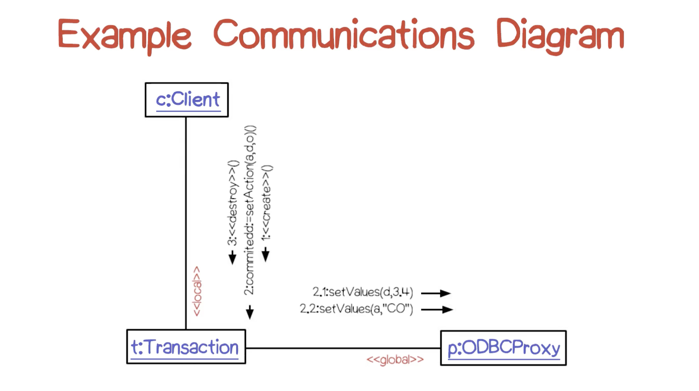

### Activity diagram
- Key points:
	- Variant of a state machine in which states may be simultaneously active
	- Derived from Petri nets
	- Transitions typically triggered by activity completion
	- Used to model workflows, process synchronization, concurrency
- 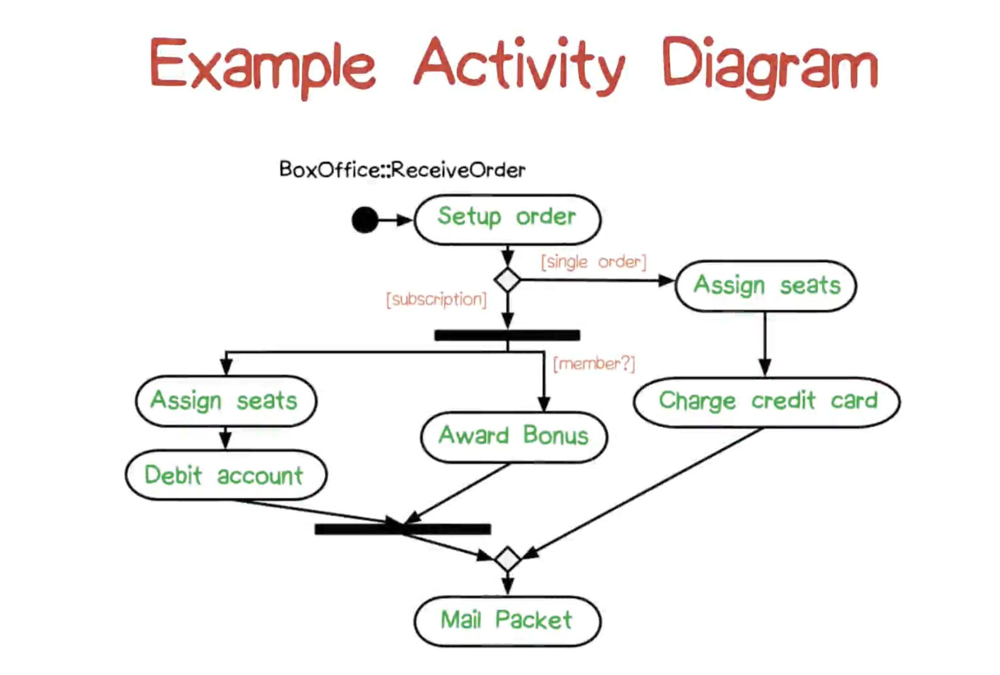

### Interaction overview diagram
- 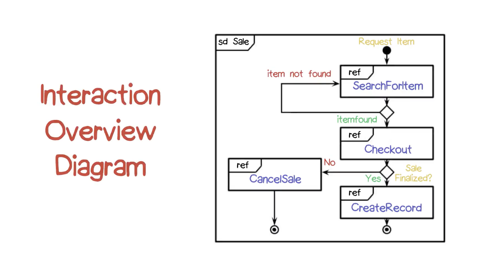

### Timing diagram
- 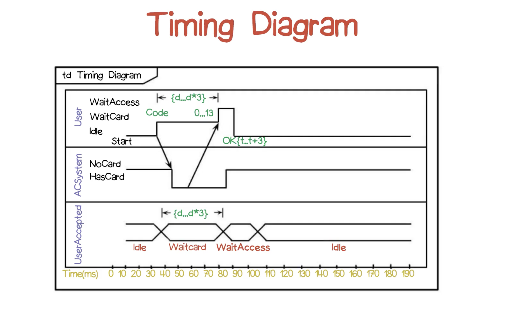

### State diagram
- Key points:
	- Most powerful and most complex type of UML behavior diagram
	- Also called StateCharts
	- Extenede finite state machines
- 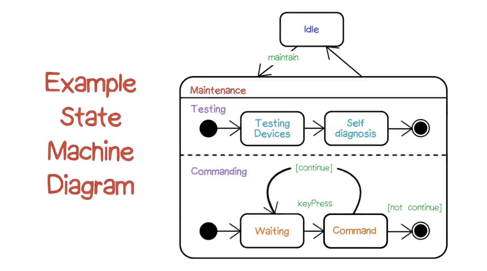

## UML references
- [UML Reference Manual (Rumbaugh, Booch, and Jacobson)](https://www.amazon.com/Modeling-Language-Reference-Addison-Wesley-Technology/dp/0321245628/ref=dp_ob_title_bk)
- [UML User Guide (Rumbaugh, Booch, and Jacobson)](https://www.amazon.com/Unified-Modeling-Language-User-Guide/dp/0321267974/ref=dp_ob_title_bk)
- [UML Superstructure Specification v2.4.1.](https://www.omg.org/spec/UML/2.4.1/Superstructure/PDF)
- [UML Distilled: Applying the Standard Object Modeling Language (Fowler)](https://www.amazon.com/UML-Distilled-Standard-Modeling-Language/dp/0321193687/ref=dp_ob_title_bk)

